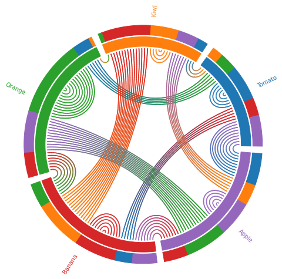
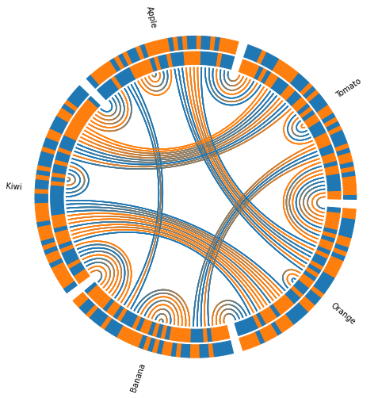

# Chordialement



Chord diagrams ('circos') can be used to visualize a very specific type of dataset. The data should contain observations that fall in discrete categories and have pairwise, but ideally bidirectional, association between observations. Say a dataset containing information about twins' political opinions, or couples favourite fruits.  

In most cases, these plots don't bring more information than a triangular [jointplot](https://seaborn.pydata.org/generated/seaborn.jointplot.html). But they are arguably prettier and allow to show individual observation. It can also be easier to add more information to the plot (by modifying the width & color of the link for example). 

This package is another attempt to make them easy to plot. Similar tentatives include [Circos](http://circos.ca), [Chord](https://pypi.org/project/chord/), [Bokeh](https://bokeh.org) and [plotly](https://plotly.org). I wanted a pure python one, based on matplotlib, and personalizable so this is it.

## Install

``` sh
git clone git@github.com:Thopic/chordialement.git
pip install -r .
```

## Example.

The `chord_diagram` function plot a diagram colored by categories (ie the color of the lines match the ordering). The `colored_chords` function add a `hue` parameter so you can choose the color independantly of the ordering, but it doesn't order the data correctly, so `chord_diagram` must be ran first.

``` python
import pandas as pd
import numpy as np
from chordialement import chord_diagram, colored_chords

rng = np.random.default_rng()
df = pd.DataFrame()
df["favourite_fruit"] = rng.choice(["Apple", "Orange", "Kiwi", "Tomato", "Banana"], size=200)
df["couple"] = rng.choice(list(range(100))*2, size=200, replace=False)
df["Like Potatoes"] = rng.choice([True, False], size=200)
data, ax = chord_diagram(categories="favourite_fruit", pair="couple", 
                         layout_args={'spacing': 0.01, 'internal_chords': True},
                         data=df)
data, ax = colored_chords(data, pair="couple", categories="favourite_fruit",
                          hue="Like Potatoes", layout_args={'spacing':0.02, 'internal_chords': True})

```



